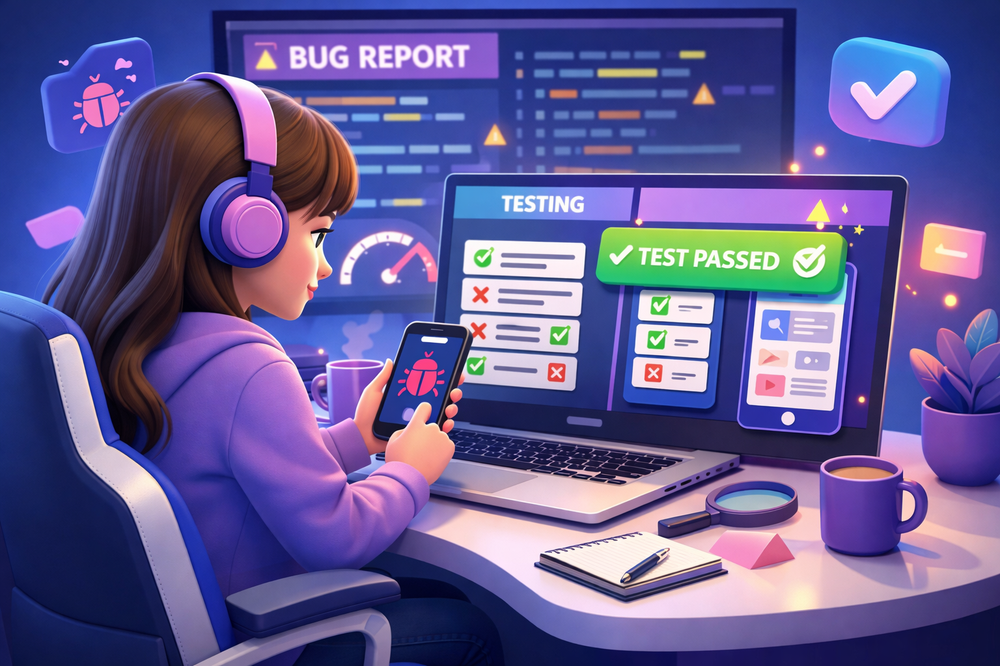

  

<table align="center">
  <tr>
    <td align="left" width="58%">
      
    </td>
    <td align="left" width="42%">
      
    </td>
  </tr>
</table>

---

  
  
 

---

## 💎 About Me

- 🎓 Software Engineering Student @ **The Open University of Sri Lanka**
- 🧪 Passionate about **Software Quality Assurance & Testing**
- 💻 Interested in **QA Focused Project Building**
- 🚀 I love building **clean, user-friendly, and reliable systems**
- 🌱 Currently learning **QA Automation, Testing Practices, and Advanced Development**
- 🎯 Goal: Become a **Professional QA Engineer**
- ✨ I enjoy mixing **quality, design, and functionality** in my projects

 

---

## 🛠️ Tech Stack

  
  
  
  
  
  
  
  
  
  
  
  
  
  
  
  
  
  
  
  
  
  
  
  
  
  
  
  
  
 

## 📊 GitHub Stats

<table align="center">
  <tr>
    <td align="center">
      
    </td>
    <td align="center">
      
    </td>
  </tr>
  <tr>
    <td align="center">
      
    </td>
    <td align="center">
      
    </td>
  </tr>
</table>

## 📈 Contribution Graph

  

---

<h2 align="center">💡 Motto</h2>
<h3 align="center"><i>Test with purpose. Build with quality. Grow with consistency.</i></h3>

---

## 🌐 Connect With Me

  
  
  
  
  
  

  

